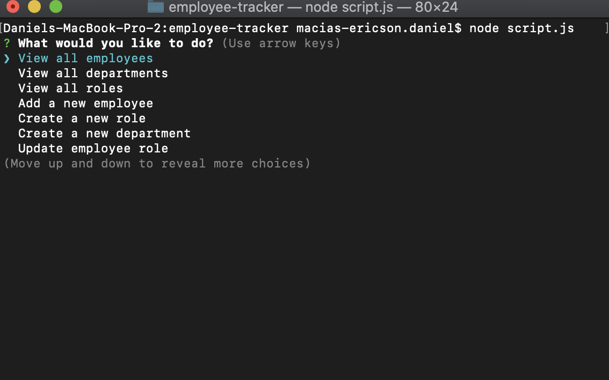
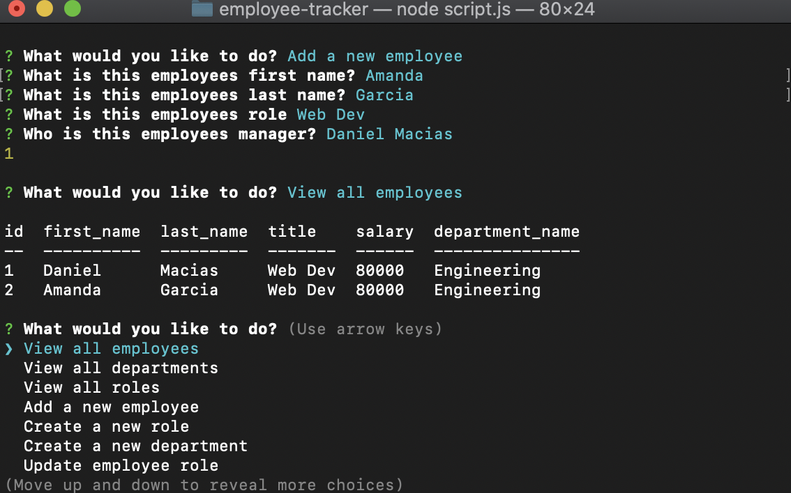

# Employee Tracker
 

 

Menu Example

 

Employee view

 

## Description

Command line control employee tracker. Create and manage employees, their salaries, company roles, and compant departments

## Table Of Contents

* [Installation](#Installation)

* [Usage](#Usage)

* [License](#License)

* [Contributing](#Contributing)

* [Questions](#Questions)

## Installation
When first opening the project run npm install to install all of the required dependencies

## Usage
Once all the required depndencies are installed just type npm script.js to start tracking!

## License
This project is licensed under: MIT

## Contributing 
If you feel the need to contribute, submit a detailed description of the features you would like to add when you create a pull request

## Questions

Contact me at d.macias.apps@gmail.com if you have any questions about my project!
